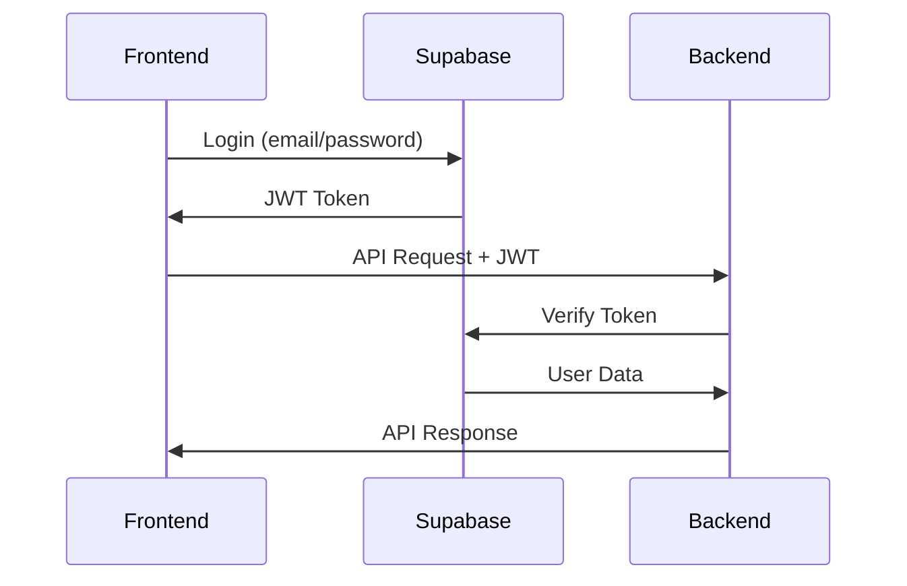

# API GDE - Documentación

## 📋 Resumen General

La API de GDE está diseñada como un sistema híbrido que combina la potencia de Supabase para operaciones simples y FastAPI para procesamiento complejo. Esta arquitectura permite optimizar el rendimiento y la escalabilidad del sistema.

## 🏗️ Arquitectura de la API

### Flujo de Comunicación
```
Frontend (Next.js)
├── Supabase (Directo) → Operaciones simples
│   ├── CRUD básico
│   ├── Autenticación
│   ├── Suscripciones en tiempo real
│   └── Storage de archivos
└── Backend (FastAPI) → Procesamiento complejo
    ├── Cálculos contables
    ├── Procesamiento de archivos
    ├── Generación de reportes
    └── Integraciones externas
```

### Endpoints Principales
- **Base URL**: `https://api.gde-system.com/v1`
- **Autenticación**: Bearer Token (JWT)
- **Formato**: JSON
- **Versión**: v1

## 🔐 Autenticación

### Métodos de Autenticación
1. **Supabase Auth** (Frontend directo)
2. **JWT Tokens** (Backend API)

### Headers Requeridos
```http
Authorization: Bearer <jwt_token>
Content-Type: application/json
```

### Flujo de Autenticación


## 📊 Endpoints por Módulo

### 1. Autenticación
```http
POST /auth/login
POST /auth/logout
POST /auth/refresh
GET  /auth/me
```

### 2. Productos
```http
GET    /products              # Listar productos
POST   /products              # Crear producto
GET    /products/{id}         # Obtener producto
PUT    /products/{id}         # Actualizar producto
DELETE /products/{id}         # Eliminar producto
GET    /products/{id}/kardex  # Historial de movimientos
```

### 3. Guías
```http
GET    /guias                 # Listar guías
POST   /guias                 # Crear guía
GET    /guias/{id}            # Obtener guía
PUT    /guias/{id}            # Actualizar guía
DELETE /guias/{id}            # Eliminar guía
POST   /guias/{id}/items      # Agregar items
PUT    /guias/{id}/status     # Cambiar estado
GET    /guias/{id}/tracking   # Seguimiento
```

### 4. Pistoleo
```http
POST   /pistoleo/sessions     # Crear sesión
GET    /pistoleo/sessions     # Listar sesiones
GET    /pistoleo/sessions/{id} # Obtener sesión
PUT    /pistoleo/sessions/{id} # Actualizar sesión
DELETE /pistoleo/sessions/{id} # Finalizar sesión
POST   /pistoleo/scan         # Registrar escaneo
GET    /pistoleo/scan/{id}    # Obtener escaneo
```

### 5. Costos
```http
GET    /costos                # Listar costos
POST   /costos                # Crear costo
GET    /costos/{id}           # Obtener costo
PUT    /costos/{id}           # Actualizar costo
DELETE /costos/{id}           # Eliminar costo
GET    /costos/categories     # Categorías
POST   /costos/categories     # Crear categoría
```

### 6. Reportes
```http
GET    /reports/inventory     # Reporte de inventario
GET    /reports/sales         # Reporte de ventas
GET    /reports/costs         # Reporte de costos
GET    /reports/guias         # Reporte de guías
POST   /reports/generate      # Generar reporte personalizado
```

### 7. Archivos
```http
POST   /files/upload          # Subir archivo
GET    /files/{id}            # Descargar archivo
DELETE /files/{id}            # Eliminar archivo
POST   /files/import          # Importar datos
GET    /files/import/{id}     # Estado de importación
```

## 📝 Esquemas de Datos

### Product
```json
{
  "id": 1,
  "code": "PROD001",
  "name": "Producto Ejemplo",
  "description": "Descripción del producto",
  "category_id": 1,
  "stock_actual": 100,
  "stock_minimo": 10,
  "stock_maximo": 500,
  "precio_compra": 25.50,
  "precio_venta": 35.00,
  "ubicacion_bodega": "A-1-1",
  "proveedor": "Proveedor ABC",
  "codigo_barras": "1234567890123",
  "imagenes": ["url1", "url2"],
  "status": "active",
  "created_at": "2024-01-01T00:00:00Z",
  "updated_at": "2024-01-01T00:00:00Z"
}
```

### Guia
```json
{
  "id": 1,
  "codigo": "GUI001",
  "estado": "pendiente",
  "cliente_nombre": "Cliente ABC",
  "cliente_ruc": "1234567890001",
  "cliente_direccion": "Av. Principal 123",
  "cliente_telefono": "+593 4 123-4567",
  "cliente_email": "cliente@example.com",
  "direccion_entrega": "Av. Secundaria 456",
  "fecha_creacion": "2024-01-01T00:00:00Z",
  "fecha_estimada_entrega": "2024-01-02",
  "transportista": "Transporte XYZ",
  "peso_total": 150.5,
  "valor_declarado": 500.00,
  "observaciones": "Manejar con cuidado",
  "items": [
    {
      "id": 1,
      "product_id": 1,
      "cantidad": 10,
      "precio_unitario": 35.00,
      "subtotal": 350.00
    }
  ]
}
```

### PistoleoSession
```json
{
  "id": 1,
  "codigo_qr": "QR123456789",
  "usuario_id": "uuid-user-id",
  "nombre_sesion": "Sesión Matutina",
  "fecha_inicio": "2024-01-01T08:00:00Z",
  "fecha_fin": null,
  "estado": "active",
  "escaneos_totales": 25,
  "guias_procesadas": 5,
  "ubicacion": "Bodega Principal",
  "observaciones": "Sesión de prueba"
}
```

### Costo
```json
{
  "id": 1,
  "fecha": "2024-01-01",
  "categoria_id": 1,
  "subcategoria": "Combustible",
  "descripcion": "Compra de combustible",
  "monto": 150.00,
  "proveedor": "Gasolinera ABC",
  "documento": "factura",
  "numero_documento": "FAC-001-2024",
  "estado": "pagado",
  "metodo_pago": "transferencia",
  "observaciones": "Pago mensual",
  "evidencias": ["url1", "url2"]
}
```

## 🔄 Operaciones CRUD

### Crear Producto
```http
POST /api/v1/products
Content-Type: application/json
Authorization: Bearer <token>

{
  "code": "PROD002",
  "name": "Nuevo Producto",
  "description": "Descripción del nuevo producto",
  "category_id": 1,
  "stock_actual": 50,
  "stock_minimo": 5,
  "precio_compra": 20.00,
  "precio_venta": 30.00,
  "proveedor": "Proveedor XYZ"
}
```

**Respuesta:**
```json
{
  "id": 2,
  "code": "PROD002",
  "name": "Nuevo Producto",
  "description": "Descripción del nuevo producto",
  "category_id": 1,
  "stock_actual": 50,
  "stock_minimo": 5,
  "precio_compra": 20.00,
  "precio_venta": 30.00,
  "proveedor": "Proveedor XYZ",
  "status": "active",
  "created_at": "2024-01-01T12:00:00Z",
  "updated_at": "2024-01-01T12:00:00Z"
}
```

### Actualizar Producto
```http
PUT /api/v1/products/2
Content-Type: application/json
Authorization: Bearer <token>

{
  "stock_actual": 75,
  "precio_venta": 35.00
}
```

### Eliminar Producto
```http
DELETE /api/v1/products/2
Authorization: Bearer <token>
```

**Respuesta:**
```json
{
  "message": "Product deleted successfully"
}
```

## 📊 Consultas y Filtros

### Paginación
```http
GET /api/v1/products?page=1&limit=20
```

### Filtros
```http
GET /api/v1/products?category_id=1&status=active
GET /api/v1/products?stock_min=10&stock_max=100
GET /api/v1/products?proveedor=ABC
```

### Búsqueda
```http
GET /api/v1/products?search=producto
GET /api/v1/products?code=PROD001
```

### Ordenamiento
```http
GET /api/v1/products?sort=name&order=asc
GET /api/v1/products?sort=created_at&order=desc
```

## 📈 Reportes y Análisis

### Reporte de Inventario
```http
GET /api/v1/reports/inventory?start_date=2024-01-01&end_date=2024-01-31
```

**Respuesta:**
```json
{
  "summary": {
    "total_products": 150,
    "total_value": 25000.00,
    "low_stock_count": 5,
    "out_of_stock_count": 2
  },
  "by_category": [
    {
      "category": "Electrónicos",
      "count": 50,
      "value": 15000.00
    }
  ],
  "low_stock": [
    {
      "id": 1,
      "code": "PROD001",
      "name": "Producto A",
      "stock_actual": 5,
      "stock_minimo": 10
    }
  ]
}
```

### Reporte de Ventas
```http
GET /api/v1/reports/sales?period=month&year=2024&month=1
```

### Reporte de Costos
```http
GET /api/v1/reports/costs?category_id=1&start_date=2024-01-01&end_date=2024-01-31
```

## 📁 Gestión de Archivos

### Subir Archivo
```http
POST /api/v1/files/upload
Content-Type: multipart/form-data
Authorization: Bearer <token>

file: <archivo>
type: excel
```

**Respuesta:**
```json
{
  "id": "file-uuid",
  "filename": "productos.xlsx",
  "size": 1024000,
  "type": "excel",
  "uploaded_at": "2024-01-01T12:00:00Z",
  "url": "https://storage.example.com/files/file-uuid"
}
```

### Importar Datos
```http
POST /api/v1/files/import
Content-Type: application/json
Authorization: Bearer <token>

{
  "file_id": "file-uuid",
  "entity_type": "products",
  "options": {
    "skip_errors": true,
    "update_existing": false
  }
}
```

**Respuesta:**
```json
{
  "import_id": "import-uuid",
  "status": "processing",
  "total_records": 100,
  "processed_records": 0,
  "successful_records": 0,
  "failed_records": 0
}
```

### Estado de Importación
```http
GET /api/v1/files/import/import-uuid
Authorization: Bearer <token>
```

## 🔔 Notificaciones

### Suscripción a Notificaciones
```http
POST /api/v1/notifications/subscribe
Content-Type: application/json
Authorization: Bearer <token>

{
  "endpoint": "https://fcm.googleapis.com/fcm/send/...",
  "keys": {
    "p256dh": "...",
    "auth": "..."
  }
}
```

### Enviar Notificación
```http
POST /api/v1/notifications/send
Content-Type: application/json
Authorization: Bearer <token>

{
  "title": "Stock Bajo",
  "body": "El producto PROD001 tiene stock bajo",
  "data": {
    "type": "low_stock",
    "product_id": 1
  }
}
```

## 🚨 Manejo de Errores

### Códigos de Estado HTTP
- `200` - OK
- `201` - Created
- `400` - Bad Request
- `401` - Unauthorized
- `403` - Forbidden
- `404` - Not Found
- `422` - Unprocessable Entity
- `500` - Internal Server Error

### Formato de Error
```json
{
  "error": {
    "code": "VALIDATION_ERROR",
    "message": "Los datos proporcionados no son válidos",
    "details": [
      {
        "field": "code",
        "message": "El código es requerido"
      },
      {
        "field": "stock_actual",
        "message": "El stock debe ser un número positivo"
      }
    ]
  }
}
```

### Errores Comunes
```json
{
  "error": {
    "code": "UNAUTHORIZED",
    "message": "Token de autenticación inválido o expirado"
  }
}
```

```json
{
  "error": {
    "code": "NOT_FOUND",
    "message": "El recurso solicitado no existe"
  }
}
```

```json
{
  "error": {
    "code": "DUPLICATE_CODE",
    "message": "Ya existe un producto con este código"
  }
}
```

## 🔒 Seguridad

### Rate Limiting
- **Límite**: 1000 requests por hora por IP
- **Burst**: 100 requests por minuto
- **Headers de respuesta**:
  ```
  X-RateLimit-Limit: 1000
  X-RateLimit-Remaining: 999
  X-RateLimit-Reset: 1640995200
  ```

### Validación de Datos
- Todos los inputs son validados con Pydantic
- Sanitización automática de datos
- Validación de tipos y formatos
- Límites de tamaño de archivos

### CORS
```javascript
// Configuración CORS
{
  "origins": ["https://gde-frontend.vercel.app"],
  "methods": ["GET", "POST", "PUT", "DELETE"],
  "headers": ["Authorization", "Content-Type"]
}
```

## 📚 SDKs y Librerías

### JavaScript/TypeScript
```bash
npm install @gde/api-client
```

```typescript
import { GDEApiClient } from '@gde/api-client'

const client = new GDEApiClient({
  baseUrl: 'https://api.gde-system.com/v1',
  token: 'your-jwt-token'
})

// Usar el cliente
const products = await client.products.list()
const product = await client.products.create({
  code: 'PROD001',
  name: 'Producto Test'
})
```

### Python
```bash
pip install gde-api-client
```

```python
from gde_api_client import GDEApiClient

client = GDEApiClient(
    base_url='https://api.gde-system.com/v1',
    token='your-jwt-token'
)

# Usar el cliente
products = client.products.list()
product = client.products.create({
    'code': 'PROD001',
    'name': 'Producto Test'
})
```

## 🧪 Testing

### Postman Collection
- Collection completa disponible en `/docs/postman/`
- Variables de entorno configuradas
- Tests automáticos incluidos

### cURL Examples
```bash
# Crear producto
curl -X POST "https://api.gde-system.com/v1/products" \
  -H "Authorization: Bearer <token>" \
  -H "Content-Type: application/json" \
  -d '{
    "code": "PROD001",
    "name": "Producto Test",
    "stock_actual": 100
  }'

# Obtener productos
curl -X GET "https://api.gde-system.com/v1/products" \
  -H "Authorization: Bearer <token>"
```

## 📖 Documentación Interactiva

### Swagger UI
- **URL**: `https://api.gde-system.com/docs`
- **Funcionalidades**:
  - Explorar endpoints
  - Probar requests
  - Ver esquemas
  - Descargar OpenAPI spec

### ReDoc
- **URL**: `https://api.gde-system.com/redoc`
- **Funcionalidades**:
  - Documentación legible
  - Esquemas detallados
  - Ejemplos de uso

## 🚀 Próximos Pasos

1. Configurar endpoints de Supabase
2. Implementar endpoints de FastAPI
3. Configurar autenticación
4. Implementar validaciones
5. Crear documentación interactiva
6. Configurar testing
7. Implementar rate limiting
8. Configurar monitoreo
